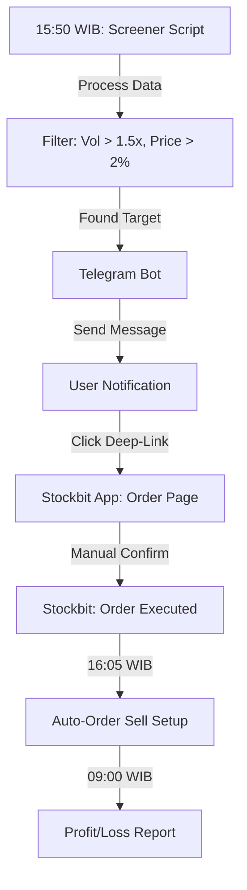

# Dawn Dash (Hybrid-Automation Edition) — Implementation Specification [#1]

## 📊 Overview

### Purpose
Dawn Dash is a "Semi-Auto" trading assistant designed to execute the **Buy Afternoon Sell Morning (BSJP)** strategy with minimal manual intervention (< 1 minute/day). It bridges the gap between manual screening and professional automation by using Telegram as a lightweight control interface.

### Key Principle
**"Efficiency over Complexity"**: Speed up execution with Deep-Links and Auto-Orders while keeping the user in control of the final buy signal.

### User Experience
1. **15:50 WIB**: User receives a Telegram notification with a curated BSJP stock candidate.
2. **15:51 WIB**: User clicks the "Beli" link in Telegram, which opens the Stockbit app directly to the Order page.
3. **15:52 WIB**: User confirms the buy order.
4. **16:00 WIB**: System reminds the user to set an Auto-Order (Sell) for the next morning.
5. **09:00 WIB (Next Day)**: Auto-Order executes; system sends a Profit/Loss report.

---

## 🎯 Design Principles
- **Safety First**: No trading PINs or credentials stored in the bot.
- **Deep-Link Driven**: Minimize navigation clicks inside third-party apps.
- **Python/Docker Stack**: Reliable, portable execution environment.

---

## 📐 Architecture Design

### Logic Flow

### Components
- **Bot Engine (Python)**: Handles scheduling, Stockbit data processing (simulated/API if available), and Telegram message delivery.
- **Telegram Interface**: Command and Alert hub.
- **Implementation Strategy**: Dockerized Python script using `python-telegram-bot` and a scheduler.

---

## 🔧 Implementation Details

### Phase 1: Infrastructure & Bot Setup (Current)
- [ ] Setup Docker environment with Python.
- [ ] Initialize Telegram Bot and basic "Ping" command.
- [ ] Document Stockbit Screener configuration.

### Phase 2: Signal Generation (Mary)
- [ ] Define the exact Stockbit Screener rules in the bot.
- [ ] Format the "Buy" message with stock data and technical indicators.

### Phase 3: One-Click Execution (Winston)
- [ ] Research and implement Stockbit Deep-Link URL format.
- [ ] Integrate Risk Guard (Stop Loss) reminders.

---

## ✅ Implementation Checklist
- [ ] Unit tests for signal logic
- [ ] Integration tests for Telegram notifications
- [ ] Docker container builds successfully
- [ ] No credentials in repository (using environment variables)

---

## 🔮 Future Enhancements
- Support for multiple brokerage links (not just Stockbit/Bibit).
- Direct API integration for full automation (if regulation/access permits).
- Portfolio performance tracking history.
