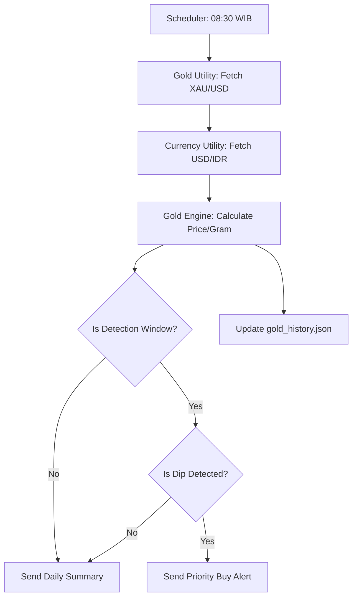

# Gold Price Monitor — Implementation Specification [#2]

## 📊 Overview

### Purpose
Help users optimize their monthly gold investment by identifying "Buy the Dip" opportunities within a specific monthly window (e.g., payday window). This prevents the user from buying at monthly local peaks.

### Key Principle
**"Dynamic DCA (Dollar Cost Averaging)"**: Instead of buying on a fixed date, wait for a statistically favorable entry point within a predefined time window.

### User Experience
1. **Daily Update**: Bot sends a daily gold price summary (IDR/Gram) every morning.
2. **Detection Window**: Starting from the 20th of every month, the bot enters "Alert Mode".
3. **Dip Alert**: If the price drops by >1.5% compared to the 7-day average or hits a new monthly low, the bot sends a priority alert.
4. **Action**: User clicks the "Beli" link (to Pegadaian/Antam/Treasury) to execute the trade.

---

## 🎯 Design Principles
- **Currency Localization**: All prices displayed in Indonesian Rupiah (IDR).
- **Unit Standardization**: Conversion from international Spot Gold (Troy Oz) to local Grams.
- **Persistence**: Store daily prices locally to calculate trends without re-fetching historical data.

---

## 📐 Architecture Design

### Data Flow / Logic Flow


### Data Structure
**`data/gold_history.json`**
```json
{
  "last_updated": "2026-04-13",
  "history": [
    {"date": "2026-04-12", "price_idr": 1250000},
    {"date": "2026-04-13", "price_idr": 1235000}
  ]
}
```

---

## 🔧 Implementation Details

### Phase 1: Infrastructure
- [ ] Implement `GoldAPI` utility for MetalpriceAPI.
- [ ] Setup persistence storage for historical prices.

### Phase 2: Logic & Notification
- [ ] Implement "Dip Detection" algorithm.
- [ ] Add HTML-formatted Telegram messages for gold updates.

---

## 📡 API Reference

### MetalpriceAPI (External)
- **Endpoint**: `https://api.metalpriceapi.com/v1/latest`
- **Params**: `base=USD`, `symbols=XAU,IDR`

---

## ✅ Implementation Checklist
- [ ] Unit tests for Troy Oz to Gram conversion
- [ ] Integration tests for seasonal window logic (20th-end)
- [ ] Documentation updated in LLD.md

---

## 📊 Example Scenarios

### Scenario 1: Daily Summary (Normal)
- **Input**: Date is 15th, Price is stable.
- **Output**: Bot sends "Harga Emas Hari Ini: Rp 1.250.000/gr (Stagnan)".

### Scenario 2: Dip Alert (Window Active)
- **Input**: Date is 22nd, Price drops 2% from last week.
- **Output**: Bot sends "🚀 ALERT: Harga Emas Anjlok! Sekarang Rp 1.225.000/gr. Waktu terbaik untuk cicilan bulan ini."

---

## 🔮 Future Enhancements
- Support for Pegadaian/Antam direct API (if available).
- Integration with Portfolio tracking to log buy price automatically.
